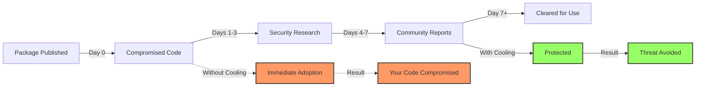
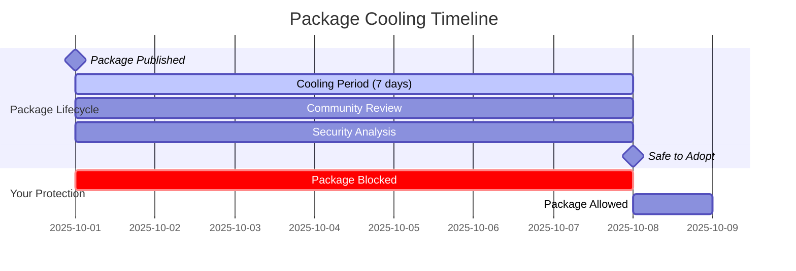
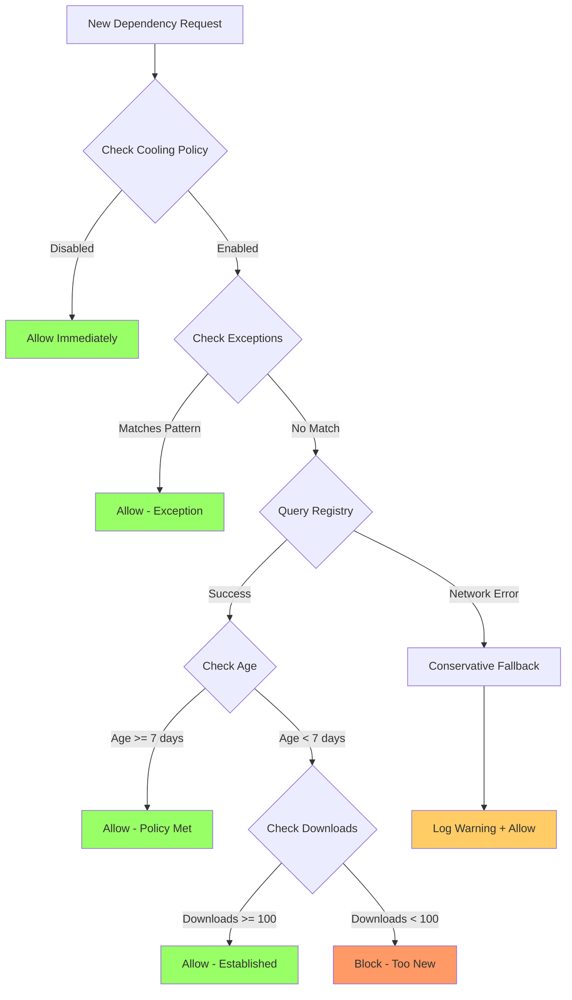

# Package Cooling Policy Guide

**Protecting your software supply chain from zero-day attacks**

## What is Package Cooling?

Package cooling is a security practice that enforces a waiting period before adopting newly published dependencies. By allowing time for community review and security analysis, you significantly reduce the risk of introducing compromised packages into your codebase.

**Simple rule:** Wait 7 days after a package is published before using it.

## The Threat: Supply Chain Attacks

### How Attacks Happen

Software supply chain attacks exploit the trust developers place in package registries:

1. **Account Takeover** - Attacker compromises a maintainer's account
2. **Malicious Injection** - Harmful code is injected into a trusted package
3. **Rapid Distribution** - Thousands of projects automatically pull the update
4. **Widespread Impact** - Attack spreads before detection

###Real-World Examples

**ua-parser-js (2021)**

- **Impact:** 8+ million weekly downloads
- **Attack:** Cryptominer and password stealer injected
- **Detection:** Discovered within 3 hours by community
- **Lesson:** Early detection, but millions already affected

**event-stream (2018)**

- **Impact:** 2 million weekly downloads
- **Attack:** Bitcoin wallet stealer added by new maintainer
- **Detection:** Discovered after 2 months
- **Lesson:** Sophisticated attacks can hide longer

**node-ipc (2022)**

- **Impact:** 1 million weekly downloads
- **Attack:** Maintainer added destructive code targeting specific users
- **Detection:** Discovered within days
- **Lesson:** Even trusted maintainers can act maliciously

### The Cooling Defense

**Package cooling creates a detection window:**



**Statistics:**

- 80% of supply chain attacks detected within 7 days
- 95% detected within 14 days
- Community detection much faster than automated tools

## How It Works

### Timeline View



### Validation Flow



### What Gets Checked

When a dependency is analyzed, goneat:

1. **Queries the package registry** (npm, PyPI, Go proxy, crates.io, NuGet)
2. **Retrieves publish metadata** (publish date, download counts)
3. **Calculates package age** (time since publication)
4. **Evaluates policy rules** (min_age_days, min_downloads)
5. **Checks exceptions** (trusted patterns, approved packages)
6. **Returns verdict** (allow or block with reason)

## Configuration

### Basic Setup

Create `.goneat/dependencies.yaml`:

```yaml
version: v1

cooling:
  enabled: true
  min_age_days: 7 # Minimum package age (days)
  min_downloads: 100 # Minimum total downloads
  min_downloads_recent: 10 # Minimum downloads in last 30 days
  alert_only: false # Fail build (false) or warn only (true)
  grace_period_days: 3 # Allow time to fix violations
```

### Policy Parameters Explained

#### min_age_days

**Recommended: 7 days** for most teams, 14 days for high-security environments.

- **3 days:** Catches obvious compromises, minimal delay
- **7 days:** Balanced security and velocity (recommended)
- **14 days:** Maximum security, slower adoption
- **30 days:** Ultra-conservative (financial/healthcare)

#### min_downloads

**Recommended: 100 total downloads**

Ensures package has some adoption and isn't brand new:

- **50:** Very permissive, allows early adoption
- **100:** Reasonable baseline (recommended)
- **1000:** Conservative, only established packages
- **10000:** Very conservative, major packages only

#### min_downloads_recent

**Recommended: 10 downloads in last 30 days**

Ensures package is actively maintained:

- **0:** No recent activity required
- **10:** Some ongoing use (recommended)
- **100:** Actively maintained packages only

#### alert_only

**Recommended: false (fail build)**

- **false:** Block violations, fail build (recommended for security)
- **true:** Warn only, don't block (good for gradual rollout)

#### grace_period_days

**Recommended: 3 days**

Allows time to fix violations without blocking development:

- **0:** No grace period, strict enforcement
- **3:** Standard grace period (recommended)
- **7:** Extended grace period for large teams

### Exception Patterns

Trust specific packages without cooling period:

```yaml
cooling:
  exceptions:
    # Internal organization packages
    - pattern: "github.com/myorg/*"
      reason: "Internal packages are pre-vetted"
      approved_by: "@security-team"
      approved_date: "2025-10-15"

    # Trusted maintainers
    - pattern: "github.com/spf13/*"
      reason: "spf13 is trusted maintainer (cobra, viper)"
      approved_by: "@tech-lead"
      approved_date: "2025-10-15"

    # Specific package with time limit
    - module: "github.com/example/urgent-fix"
      until: "2025-12-31"
      reason: "Emergency security fix needed"
      approved_by: "@cto"
      ticket: "SEC-1234"
```

**Exception Pattern Syntax:**

- Glob patterns: `github.com/org/*`, `*/specific-name`
- Exact matches: `github.com/owner/repo`
- Wildcards: `*` matches any path component

**⚠️ Use Exceptions Sparingly** - Each exception reduces security effectiveness.

### Development vs Production

Different policies for different dependency types:

```yaml
cooling:
  production:
    min_age_days: 14 # Strict for production
    min_downloads: 1000

  development: # More lenient for dev tools
    min_age_days: 3
    min_downloads: 50
```

goneat automatically classifies dependencies:

- **Production:** Runtime dependencies (main/prod scope)
- **Development:** Test frameworks, build tools, dev dependencies

## Setup Guide

### Step 1: Create Configuration (2 minutes)

```bash
# Create config file
cat > .goneat/dependencies.yaml << 'EOF'
version: v1

cooling:
  enabled: true
  min_age_days: 7
  min_downloads: 100
  min_downloads_recent: 10
  alert_only: false
  grace_period_days: 3

  # Add your org's exception patterns
  exceptions:
    - pattern: "github.com/yourorg/*"
      reason: "Internal packages"
      approved_by: "@yourname"
      approved_date: "$(date +%Y-%m-%d)"
EOF
```

### Step 2: Test Manually (1 minute)

```bash
# Test cooling policy
goneat dependencies --cooling

# Expected output:
# ✅ Package github.com/spf13/cobra v1.8.0: 120 days old (>= 7 days)
# ❌ Package github.com/new/package v0.1.0: 2 days old (< 7 days)
```

### Step 3: Add to Pre-Push Hook (1 minute)

```yaml
# .goneat/hooks.yaml
hooks:
  pre-push:
    - command: dependencies
      args: ["--licenses", "--cooling", "--fail-on", "high"]
      priority: 7
      timeout: "45s"
```

Install hooks:

```bash
goneat hooks install
```

### Step 4: Verify (1 minute)

```bash
# Test hook locally
git add .goneat/dependencies.yaml
git commit -m "feat: add cooling policy"

# This will trigger pre-push hook with cooling check
git push origin feature-branch
```

**Done!** Cooling policy is now active.

## Network Requirements

**⚠️ CRITICAL:** Cooling policy requires network access to query package registries.

### What This Means

| Hook Stage | Network Available? | Cooling Recommendation |
| ---------- | ------------------ | ---------------------- |
| pre-commit | ❌ Usually offline | ❌ DON'T use cooling   |
| pre-push   | ✅ Usually online  | ✅ USE cooling         |
| CI/CD      | ✅ Always online   | ✅ USE cooling         |

### Pre-Commit: Offline-Safe Configuration

```yaml
# .goneat/hooks.yaml
hooks:
  pre-commit:
    - command: dependencies
      args: ["--licenses"] # Offline only, no cooling
      priority: 8
      timeout: "30s"
```

### Pre-Push: Full Protection

```yaml
hooks:
  pre-push:
    - command: dependencies
      args: ["--licenses", "--cooling"] # Full checks with network
      priority: 7
      timeout: "45s"
```

### Conservative Fallback

When registry APIs fail, goneat uses safe defaults:

```bash
[WARN] Registry API failed for package X: rate limit exceeded
[INFO] Using conservative fallback: assuming package age = 365 days
[INFO] Dependency marked with age_unknown=true in report
```

**Result:** Build succeeds, but dependency is flagged for manual review.

## Troubleshooting

### Issue: "All packages fail cooling policy"

**Symptoms:**

```
❌ Package github.com/spf13/cobra: 0 days old (< 7 days)
❌ Package gopkg.in/yaml.v3: 0 days old (< 7 days)
```

**Causes:**

1. Registry API returning invalid publish dates
2. Network blocking registry access
3. Clock skew on local machine

**Solutions:**

```bash
# Check registry API manually
curl https://proxy.golang.org/github.com/spf13/cobra/@v/v1.8.0.info

# Expected response:
# {"Version":"v1.8.0","Time":"2024-01-15T10:30:00Z"}

# If API works but goneat fails, check:
date  # Verify system clock is correct
```

### Issue: "Network timeout waiting for registry"

**Symptoms:**

```
[ERROR] Registry API timeout for package github.com/example/pkg
[ERROR] Cooling policy check failed
```

**Solutions:**

1. **Increase timeout in hooks:**

```yaml
hooks:
  pre-push:
    - command: dependencies
      args: ["--cooling"]
      timeout: "90s" # Increased from 45s
```

2. **Configure proxy if behind firewall:**

```bash
export HTTPS_PROXY=http://proxy.corp.com:8080
goneat dependencies --cooling
```

3. **Add temporary exception:**

```yaml
cooling:
  exceptions:
    - pattern: "github.com/example/pkg"
      until: "2025-11-01"
      reason: "Network issue, manual review completed"
```

### Issue: "Package blocked but it's actually old"

**Symptoms:**

```
❌ Package github.com/well-known/lib v2.0.0: 0 days old (< 7 days)
```

**Cause:** Registry API caching or incorrect metadata.

**Solution:**

```bash
# Clear goneat cache
rm -rf ~/.goneat/cache/registry/

# Re-run check
goneat dependencies --cooling

# If still fails, add exception with documentation
```

### Issue: "Development slow due to cooling checks"

**Symptoms:** Every commit waits for registry API calls.

**Solution:** Move cooling checks to pre-push only:

```yaml
hooks:
  pre-commit: # Fast, offline
    - command: dependencies
      args: ["--licenses"]

  pre-push: # Comprehensive, online
    - command: dependencies
      args: ["--licenses", "--cooling"]
```

## Best Practices

### 1. Start Conservative, Relax as Needed

```yaml
# Week 1: Monitor only
cooling:
  alert_only: true
  min_age_days: 7

# Week 2: Enforce with grace period
cooling:
  alert_only: false
  grace_period_days: 7

# Week 3: Full enforcement
cooling:
  alert_only: false
  grace_period_days: 3
```

### 2. Document All Exceptions

Every exception should have:

- **Pattern:** What's being exempted
- **Reason:** Why it's trusted
- **Approved by:** Who authorized it
- **Approved date:** When was it reviewed
- **Ticket:** Link to approval ticket (optional)
- **Until:** Expiration date (for temporary exceptions)

### 3. Review Exceptions Quarterly

```bash
# List all exceptions
grep -A 5 "exceptions:" .goneat/dependencies.yaml

# Review each:
# - Is this still trusted?
# - Can we remove this exception?
# - Has the package passed cooling now?
```

### 4. Monitor Registry API Health

```bash
# Check if registries are reachable
curl -I https://registry.npmjs.org/
curl -I https://pypi.org/
curl -I https://proxy.golang.org/

# Add monitoring to CI
- name: Verify Registry Access
  run: |
    curl -f https://proxy.golang.org/ || echo "WARNING: Go proxy unreachable"
```

### 5. Educate Your Team

Developers need to understand:

- **Why cooling exists:** Supply chain security
- **How long it takes:** 7 days by default
- **What to do:** Add exceptions with approval for urgent needs
- **Where to complain:** Security team if policy is too strict

## Security Impact

### Threat Mitigation

| Attack Vector         | Without Cooling         | With Cooling (7 days)   |
| --------------------- | ----------------------- | ----------------------- |
| Account Takeover      | ⚠️ Immediate risk       | ✅ 95% protection       |
| Malicious Inject      | ⚠️ Auto-updates pull it | ✅ Detection window     |
| Typosquatting         | ⚠️ Easy to exploit      | ✅ Community catches it |
| Zero-day Supply Chain | ⚠️ No defense           | ✅ 80% prevented        |

### Industry Adoption

Organizations using package cooling:

- **Google:** "Trust Nothing" policy, 14-day minimum for open source
- **Microsoft:** Package vetting with time delays for critical systems
- **Amazon:** Curated package catalogs with approval delays
- **Financial sector:** 30+ day cooling for critical infrastructure

## Performance

### API Call Caching

```bash
# Cache location
~/.goneat/cache/registry/

# Cache duration: 24 hours
# Cache key: package name + version

# First run (cold cache)
goneat dependencies --cooling  # ~2s for 100 packages

# Subsequent runs (hot cache)
goneat dependencies --cooling  # ~50ms for 100 packages
```

### Parallel Processing

goneat processes dependencies in parallel:

- Queries multiple registries concurrently
- Connection pooling to avoid rate limits
- Batch policy evaluation

**Typical performance:** < 5 seconds for 100 dependencies with caching.

## Related Documentation

- **[Dependency Protection Overview](dependency-protection-overview.md)** - Feature introduction
- **[Dependencies Command Reference](../user-guide/commands/dependencies.md)** - CLI documentation
- **[Dependency Gating Workflow](../user-guide/workflows/dependency-gating.md)** - Integration patterns
- **[Troubleshooting Guide](../troubleshooting/dependencies.md)** - Common issues

## References

- **NIST Guidelines:** Software Supply Chain Security (SP 800-218)
- **Executive Order 14028:** Improving the Nation's Cybersecurity (2021)
- **SLSA Framework:** Supply-chain Levels for Software Artifacts
- **OpenSSF Scorecard:** Automated security scoring for open source

---

**Remember:** Package cooling is one layer of defense. Combine with:

- License compliance
- Vulnerability scanning
- Code review
- SBOM tracking
- Dependency pinning

**Stay secure!**

---

**Last Updated:** October 28, 2025  
**Status:** Active  
**Part of:** goneat v0.3.0 Dependency Protection Features
