# Git Hooks Operation Workflow

This guide provides a complete walkthrough of setting up and operating goneat git hooks, from initial installation to daily usage. Includes visual diagrams and practical examples for seamless integration into your development workflow.

## Overview

Goneat hooks transform git's basic hook system into an intelligent validation platform. This workflow guide shows you exactly how to set it up and what happens behind the scenes.

## Quick Start (5 Minutes)

If you want to get started immediately:

```bash
# 1. Initialize hooks system
goneat hooks init

# 2. Generate hook files
goneat hooks generate

# 3. Install to git
goneat hooks install

# 4. Test setup
goneat assess --hook pre-commit

# Done! Your hooks are now active
```

## Detailed Setup Process

### Step 1: Initialize the Hooks System

```bash
goneat hooks init
```

**What happens:**
- Creates `.goneat/hooks.yaml` with default configuration
- Sets up `.goneat/` directory structure
- Provides sensible defaults for common use cases

**Files created:**
```
.goneat/
├── hooks.yaml          # Configuration manifest
└── hooks/              # Generated hook templates (created later)
    ├── pre-commit      # Template for pre-commit hook
    └── pre-push        # Template for pre-push hook
```

### Step 2: Generate Hook Files

```bash
goneat hooks generate
```

**What happens:**
- Reads `.goneat/hooks.yaml` configuration
- Generates simple bash scripts for each hook type
- Creates fallback logic for when goneat isn't available
- Places generated files in `.goneat/hooks/` directory

**Generated hook example:**
```bash
# .goneat/hooks/pre-commit (generated)
#!/bin/bash
# Generated by goneat hooks generate

set -e
echo "🔍 Running goneat pre-commit validation..."

if ! command -v goneat &> /dev/null; then
    echo "⚠️  goneat not found, falling back to basic validation"
    go fmt ./... || exit 1
    go vet ./... || exit 1
    echo "✅ Basic validation passed"
    exit 0
fi

goneat assess --hook pre-commit --manifest .goneat/hooks.yaml
echo "✅ Pre-commit validation passed!"
```

### Step 3: Install Hooks to Git

```bash
goneat hooks install
```

**What happens:**
- Copies generated hooks from `.goneat/hooks/` to `.git/hooks/`
- Sets executable permissions (`chmod +x`)
- Provides backup of existing hooks if they exist
- Ensures git can execute the hooks

**Final directory structure:**
```
project/
├── .git/
│   └── hooks/
│       ├── pre-commit          # ← Active goneat hook
│       ├── pre-push            # ← Active goneat hook
│       ├── pre-commit.sample   # ← Git's original
│       └── pre-push.sample     # ← Git's original
├── .goneat/
│   ├── hooks.yaml              # ← Configuration
│   └── hooks/
│       ├── pre-commit          # ← Generated template
│       └── pre-push            # ← Generated template
└── source files...
```

## Visual Workflow Diagrams

### Setup Process Flow

```mermaid
graph TD
    A[Developer] --> B[goneat hooks init]
    B --> C[Create .goneat/hooks.yaml]
    C --> D[goneat hooks generate]
    D --> E[Generate .goneat/hooks/*]
    E --> F[goneat hooks install]
    F --> G[Install .git/hooks/*]
    G --> H[✅ Setup Complete]

    style A fill:#e1f5fe
    style H fill:#c8e6c9
```



### Hook Execution Flow


### Assessment Engine Flow


## Daily Usage Examples

### Standard Development Workflow

```bash
# 1. Make changes
vim main.go

# 2. Stage changes
git add main.go

# 3. Commit (triggers pre-commit hook automatically)
git commit -m "Fix bug in main function"

# Output:
# 🔍 Running goneat pre-commit validation...
# 🐾 Using goneat's intelligent assessment...
# 📊 Assessment Results:
# ├── Format: ✅ 0 issues
# ├── Lint: ⚠️ 1 issue (low severity)
# └── Overall Health: 95%
# ✅ Pre-commit validation passed!
# 🎯 Ready to commit with intelligent validation
#
# [main abc1234] Fix bug in main function
#  1 file changed, 5 insertions(+), 2 deletions(-)
```

### Push Workflow

```bash
# Push to remote (triggers pre-push hook automatically)
git push origin main

# Output:
# 🚀 Running goneat pre-push validation...
# 🐾 Using goneat's intelligent assessment...
# 📊 Assessment Results:
# ├── Format: ✅ 0 issues
# ├── Lint: ✅ 0 issues
# ├── Security: ✅ 0 issues
# └── Overall Health: 98%
# ✅ Pre-push validation passed!
# 🚀 Ready to push with security validation
#
# Enumerating objects: 5, done.
# Counting objects: 100% (5/5), done.
# ...
```

### Manual Testing

```bash
# Test what pre-commit hook would do
goneat assess --hook pre-commit

# Test with verbose output
goneat assess --hook pre-commit --verbose

# Test specific scenarios
goneat assess --hook pre-push --fail-on high
```

## Configuration Examples

### Basic Configuration

```yaml
# .goneat/hooks.yaml
version: "1.0.0"
hooks:
  pre-commit:
    - command: "assess"
      args: ["--categories", "format,lint", "--fail-on", "error"]
      stage_fixed: true
      priority: 10
      timeout: "2m"
  pre-push:
    - command: "assess"
      args: ["--full", "--format", "json", "--output", ".goneat/reports/"]
      priority: 10
      timeout: "3m"
```

### Advanced Configuration

```yaml
version: "1.0.0"
hooks:
  pre-commit:
    - command: "assess"
      args: ["--categories", "format,lint", "--fail-on", "error"]
      stage_fixed: true
      priority: 10
      timeout: "2m"
      when:
        - files_match: "*.go"
    - command: "format"
      args: ["--check", "--quiet"]
      fallback: "go fmt ./..."
      when:
        - files_match: "*.go"
      timeout: "30s"
  pre-push:
    - command: "assess"
      args: ["--full", "--format", "json", "--output", ".goneat/reports/"]
      priority: 10
      timeout: "3m"
    - command: "security"
      args: ["--scan"]
      priority: 8
      timeout: "3m"
      skip: ["merge", "rebase"]

optimization:
  only_changed_files: true
  cache_results: true
  parallel: "auto"
```

## Troubleshooting Common Issues

### Hook Not Running

**Problem:** Hook doesn't execute when expected

**Solutions:**
```bash
# Check if hook is executable
ls -la .git/hooks/pre-commit

# Verify goneat is in PATH
which goneat

# Test manual execution
goneat assess --hook pre-commit

# Check git configuration
git config --list | grep hooks
```

### Configuration Errors

**Problem:** Hook fails with configuration errors

**Solutions:**
```bash
# Validate manifest syntax
cat .goneat/hooks.yaml

# Test with minimal configuration
goneat assess --categories format

# Regenerate hooks after config changes
goneat hooks generate
goneat hooks install
```

### Performance Issues

**Problem:** Hooks take too long to execute

**Solutions:**
```bash
# Use optimization settings
vim .goneat/hooks.yaml
# Add: only_changed_files: true

# Test execution time
time goneat assess --hook pre-commit

# Adjust timeouts
goneat assess --hook pre-commit --timeout 30s
```

### Fallback Behavior

**Problem:** Fallback validation isn't working

**Solutions:**
```bash
# Check if basic tools are available
which gofmt
which go

# Test fallback manually
go fmt ./...
go vet ./...

# Verify hook fallback logic
cat .git/hooks/pre-commit
```

## Integration Patterns

### Team Collaboration

```bash
# Share configuration across team
git add .goneat/hooks.yaml
git commit -m "Update team hook configuration"

# Team members get updated hooks
git pull
goneat hooks generate
goneat hooks install
```

### CI/CD Integration

```yaml
# .github/workflows/ci.yml
name: CI
on: [push, pull_request]

jobs:
  validate:
    runs-on: ubuntu-latest
    steps:
      - uses: actions/checkout@v3
      - uses: actions/setup-go@v4
        with:
          go-version: '1.21'
      - name: Install goneat
        run: go install github.com/3leaps/goneat@latest
      - name: Run assessment
        run: goneat assess --format json --output assessment.json
      - name: Upload results
        uses: actions/upload-artifact@v3
        with:
          name: assessment-results
          path: assessment.json
```

### IDE Integration

```json
// .vscode/settings.json
{
  "go.formatTool": "goneat",
  "go.lintTool": "goneat",
  "go.vetOnSave": "package",
  "go.lintOnSave": "package",
  "go.testOnSave": false
}
```

## Advanced Scenarios

### Multi-Environment Setup

```bash
# Development (fast feedback)
goneat assess --hook pre-commit --timeout 30s

# CI/CD (comprehensive)
goneat assess --full --format json

# Production (strict)
goneat assess --fail-on medium --categories security
```

### Custom Hook Types

```yaml
# .goneat/hooks.yaml
hooks:
  pre-commit:
    # Standard validation
  post-commit:
    - command: "assess"
      args: ["--categories", "docs", "--format", "json"]
  pre-push:
    # Security and integration tests
  post-merge:
    - command: "assess"
      args: ["--categories", "dependencies", "--update"]
```

### Performance Monitoring

```bash
# Monitor hook execution time
time git commit -m "Test commit"

# Generate performance reports
goneat assess --benchmark --iterations 10

# Analyze slow hooks
goneat assess --hook pre-commit --verbose --timing
```

## Migration from Existing Hooks

### From Lefthook

```bash
# 1. Backup existing configuration
cp lefthook.yml lefthook.yml.backup

# 2. Initialize goneat hooks
goneat hooks init

# 3. Edit configuration to match your needs
vim .goneat/hooks.yaml

# 4. Generate and install
goneat hooks generate
goneat hooks install

# 5. Test before removing old hooks
goneat assess --hook pre-commit

# 6. Remove old hooks (optional)
rm lefthook.yml
```

### From Pre-commit Framework

```bash
# 1. Export existing configuration
cat .pre-commit-config.yaml

# 2. Initialize goneat hooks
goneat hooks init

# 3. Map pre-commit hooks to goneat configuration
vim .goneat/hooks.yaml

# 4. Generate and install
goneat hooks generate
goneat hooks install

# 5. Test and migrate gradually
```

## Success Metrics

Track these indicators to measure hook effectiveness:

### Performance Metrics
- **Commit time:** < 30 seconds for typical commits
- **Hook success rate:** > 95% of commits pass validation
- **False positive rate:** < 5% of rejections are incorrect

### Developer Experience Metrics
- **Time to feedback:** < 10 seconds for format/lint issues
- **Error clarity:** 100% of errors include actionable fixes
- **Adoption rate:** Team uses hooks for 90%+ of commits

### Quality Metrics
- **Issue detection:** Catches 80%+ of potential issues pre-commit
- **Auto-fix rate:** 70%+ of format issues fixed automatically
- **Security coverage:** 100% of commits scanned for security issues

## Getting Help

### Common Resources

```bash
# Show help for any command
goneat hooks --help
goneat assess --help

# Validate your setup
goneat hooks validate

# Test specific scenarios
goneat assess --hook pre-commit --verbose
```

### Community Support

- **Documentation:** [goneat.dev/docs](https://goneat.dev/docs)
- **GitHub Issues:** Report bugs and request features
- **Discussions:** Share configurations and best practices

### Professional Support

- **Enterprise Support:** Custom integrations and training
- **Consulting:** Migration assistance and optimization
- **Training:** Team workshops and best practices

## Conclusion

Goneat hooks provide a seamless upgrade from basic git hooks to intelligent validation. The setup process is straightforward, and the benefits compound over time:

- **Immediate:** Faster feedback loops and consistent validation
- **Short-term:** Better code quality and reduced review cycles
- **Long-term:** Cultural shift toward quality-first development

**The workflow is designed to be invisible during success and invaluable during problem resolution.** Your team gets enterprise-grade validation with the simplicity of standard git operations.

---

**Ready to set up your hooks?** Start with `goneat hooks init` and experience the difference intelligent validation makes in your development workflow.

**Happy coding with intelligent validation!** 🎯✨</content>
</xai:function_call/>
</xai:function_call name="list">
<parameter name="path">/Users/davethompson/dev/fulmenhq/goneat/goneat/docs/user-guide/commands