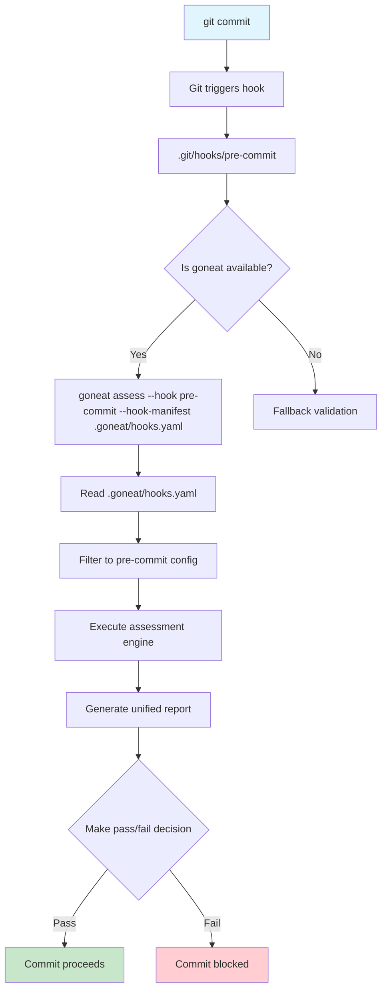
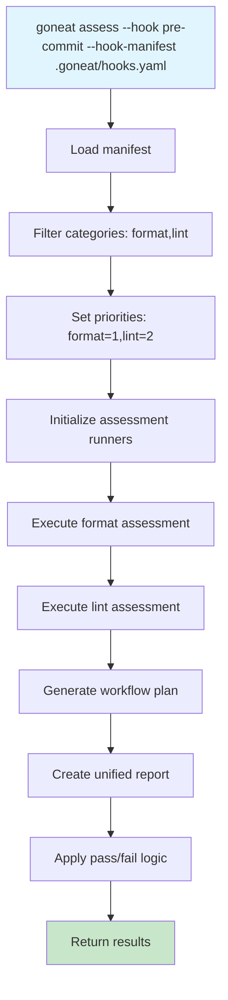

# Git Hooks Operation Workflow

This guide provides a complete walkthrough of setting up and operating goneat git hooks, from initial installation to daily usage. Includes visual diagrams and practical examples for seamless integration into your development workflow.

## Overview

Goneat hooks transform git's basic hook system into an intelligent validation platform. This workflow guide shows you exactly how to set it up and what happens behind the scenes.

## Quick Start (5 Minutes)

If you want to get started immediately:

```bash
# 1. Initialize hooks system
goneat hooks init

# 2. Generate hook files
goneat hooks generate

# 3. Install to git
goneat hooks install

# 4. (Recommended) Configure staged-only, check-only pre-commit via CLI
goneat hooks configure \
  --pre-commit-only-changed-files=true \
  --pre-commit-content-source=index \
  --pre-commit-apply-mode=check \
  --install

# 5. Validate installation
goneat hooks validate

# 6. Test setup
goneat assess --hook pre-commit

# Done! Your hooks are now active and scoped to staged files
```

Tip:

- content_source=index scopes validation to the staged version of changed files (preferred for selective commits)
- apply_mode=check avoids modifying files during pre-commit; use fix to auto-apply and re-stage when your team opts in

## Current Status Verification

Before making changes, check if you already have goneat hooks:

```bash
# Check current status
goneat hooks inspect

# If already configured, you'll see:
# 📊 Current Hook Status:
# ├── Configuration: ✅ Found
# ├── Generated Hooks: ✅ Found
# ├── Installed Hooks: ✅ Found
# └── System Health: ✅ Good (7/7)
```

## Detailed Setup Process

### Step 1: Initialize the Hooks System

```bash
goneat hooks init
```

**What happens:**

- Creates `.goneat/hooks.yaml` with default configuration
- Sets up `.goneat/` directory structure
- Provides sensible defaults for common use cases

**Files created:**

```
.goneat/
├── hooks.yaml          # Configuration manifest
└── hooks/              # Generated hook templates (created later)
    ├── pre-commit      # Template for pre-commit hook
    └── pre-push        # Template for pre-push hook
```

### Step 2: Generate Hook Files

```bash
goneat hooks generate
```

**What happens:**

- Reads `.goneat/hooks.yaml` configuration
- Generates simple bash scripts for each hook type
- Creates fallback logic for when goneat isn't available
- Places generated files in `.goneat/hooks/` directory

**Generated hook example (simplified):**

```bash
# .goneat/hooks/pre-commit (generated)
#!/bin/bash
# Generated by goneat hooks generate

set -e
echo "🔍 Running goneat pre-commit validation..."

# ...binary discovery & fallback omitted...

# When configured with only_changed_files=true or content_source=index,
# the template adds --staged-only so hooks operate on staged content.
goneat assess --hook pre-commit --hook-manifest .goneat/hooks.yaml --staged-only

echo "✅ Pre-commit validation passed!"
```

Note:

- The exact flags are templated from your manifest. Staged-only is applied automatically when either:
  - optimization.only_changed_files=true, or
  - optimization.content_source=index
- Control these via CLI: see “Configure staged-only behavior (CLI)” below.

### Step 3: Install Hooks to Git

```bash
goneat hooks install
```

**What happens:**

- Copies generated hooks from `.goneat/hooks/` to `.git/hooks/`
- Sets executable permissions (`chmod +x`)
- Creates backup of existing hooks if they exist (`.backup` extension)
- Ensures git can execute the hooks

### Step 4: Validate Installation

```bash
goneat hooks validate
```

**What happens:**

- Verifies all hook files are correctly generated and executable
- Tests configuration syntax and completeness
- Confirms goneat binary is accessible to hooks
- Reports any issues with clear remediation steps

**Example output:**

```bash
🔍 Validating hook configuration...
✅ Pre-commit hook generated
✅ Pre-push hook generated
✅ Pre-commit hook installed and executable
✅ Pre-push hook installed and executable
✅ Hook configuration validation complete
🎉 Ready to commit with intelligent validation!
```

**Final directory structure:**

```
project/
├── .git/
│   └── hooks/
│       ├── pre-commit          # ← Active goneat hook
│       ├── pre-push            # ← Active goneat hook
│       ├── pre-commit.sample   # ← Git's original
│       └── pre-push.sample     # ← Git's original
├── .goneat/
│   ├── hooks.yaml              # ← Configuration
│   └── hooks/
│       ├── pre-commit          # ← Generated template
│       └── pre-push            # ← Generated template
└── source files...
```

## Visual Workflow Diagrams

### Setup Process Flow

```mermaid
graph TD
    A[Developer] --> B[goneat hooks init]
    B --> C[Create .goneat/hooks.yaml]
    C --> D[goneat hooks generate]
    D --> E[Generate .goneat/hooks/*]
    E --> F[goneat hooks install]
    F --> G[Install .git/hooks/*]
    G --> H[✅ Setup Complete]

    style A fill:#e1f5fe
    style H fill:#c8e6c9
```



### Hook Execution Flow



### Assessment Engine Flow



## Configure staged-only behavior (CLI)

Avoid impacting work-in-progress (unstaged) changes by scoping hooks to staged files only. Configure without editing YAML:

```bash
# Show current settings
goneat hooks configure --show

# Recommended pre-commit configuration (staged-only, check-only)
goneat hooks configure \
  --pre-commit-only-changed-files=true \
  --pre-commit-content-source=index \
  --pre-commit-apply-mode=check \
  --install

# Opt-in auto-fix (re-stages changes)
goneat hooks configure --pre-commit-apply-mode=fix --install
```

What this does:

- Updates `.goneat/hooks.yaml` optimization to include `only_changed_files: true` and `content_source: index`
- Regenerates hook scripts so pre-commit/pre-push pass `--staged-only` automatically
- Optionally installs updated hooks into `.git/hooks`

Cross-reference:

- See the full command reference and flags in [../commands/hooks.md](docs/user-guide/commands/hooks.md)

## Daily Usage Examples

### Output Modes in Hooks

Goneat hooks support concise, readable summaries optimized for terminal logs, while retaining structured JSON for automation:

- Concise summary (default in hook mode): short, colorized status lines per category, totals, timing, and a clear pass/fail footer.
- JSON piping: run hooks with JSON output to persist or post-process via pretty/HTML renderers for CI dashboards or rich local views.

Examples:

```bash
# Force JSON output and pipe to pretty renderer
goneat assess --hook pre-commit --hook-manifest .goneat/hooks.yaml --format json | goneat pretty --from json --to console

# Persist JSON then open HTML report
goneat assess --hook pre-push --hook-manifest .goneat/hooks.yaml --format json --output .goneat/reports/hook.json
goneat pretty --from json --to html --input .goneat/reports/hook.json --open
```

Color in logs: concise summaries use color/highlight by default for clarity. Disable with `NO_COLOR=1` or `--no-color` for plain output. You can force the concise/markdown/json mode for hooks without changing flags via `GONEAT_HOOK_OUTPUT`.

### Standard Development Workflow

```bash
# 1. Make changes
vim main.go

# 2. Stage changes
git add main.go

# 3. Commit (triggers pre-commit hook automatically)
git commit -m "Fix bug in main function"

# Output:
# 🔍 Running goneat pre-commit validation...
# 🐾 Using goneat's intelligent assessment...
# 📊 Assessment Results:
# ├── Format: ✅ 0 issues
# ├── Lint: ⚠️ 1 issue (low severity)
# └── Overall Health: 95%
# ✅ Pre-commit validation passed!
# 🎯 Ready to commit with intelligent validation
#
# [main abc1234] Fix bug in main function
#  1 file changed, 5 insertions(+), 2 deletions(-)
```

### Push Workflow

```bash
# Push to remote (triggers pre-push hook automatically)
git push origin main

# Output:
# 🚀 Running goneat pre-push validation...
# 🐾 Using goneat's intelligent assessment...
# 📊 Assessment Results:
# ├── Format: ✅ 0 issues
# ├── Lint: ✅ 0 issues
# ├── Security: ✅ 0 issues
# └── Overall Health: 98%
# ✅ Pre-push validation passed!
# 🚀 Ready to push with security validation
#
# Enumerating objects: 5, done.
# Counting objects: 100% (5/5), done.
# ...
```

### Manual Testing

```bash
# Test what pre-commit hook would do
goneat assess --hook pre-commit

# Test with verbose output
goneat assess --hook pre-commit --verbose

# Test specific scenarios
goneat assess --hook pre-push --fail-on high
```

## Configuration Examples

### Basic Configuration

```yaml
# .goneat/hooks.yaml
version: "1.0.0"
hooks:
  pre-commit:
    - command: "assess"
      args: ["--categories", "format,lint", "--fail-on", "error"]
      stage_fixed: true
      priority: 10
      timeout: "2m"
  pre-push:
    - command: "assess"
      args: ["--full", "--format", "json", "--output", ".goneat/reports/"]
      priority: 10
      timeout: "3m"
```

### Advanced Configuration

```yaml
version: "1.0.0"
hooks:
  pre-commit:
    - command: "assess"
      args: ["--categories", "format,lint", "--fail-on", "error"]
      stage_fixed: true
      priority: 10
      timeout: "2m"
      when:
        - files_match: "*.go"
    - command: "format"
      args: ["--check", "--quiet"]
      fallback: "go fmt ./..."
      when:
        - files_match: "*.go"
      timeout: "30s"
  pre-push:
    - command: "assess"
      args: ["--full", "--format", "json", "--output", ".goneat/reports/"]
      priority: 10
      timeout: "3m"
    - command: "security"
      args: ["--scan"]
      priority: 8
      timeout: "3m"
      skip: ["merge", "rebase"]

optimization:
  only_changed_files: true
  cache_results: true
  parallel: "auto"
```

## File Filtering with .goneatignore

Goneat supports a `.goneatignore` file for controlling which files are assessed:

### Creating .goneatignore

```bash
# Create ignore file in repository root
cat > .goneatignore << 'EOF'
# Goneat ignore patterns (gitignore syntax)

# Temporary files
*.tmp
*.temp
*~

# Build artifacts
/dist/
/build/
*.exe

# Generated code
*.pb.go
*_mock.go

# Override gitignore (assess normally ignored files)
!important-ignored-file.go
EOF
```

### Ignore File Behavior

Goneat uses a layered ignore system that respects git patterns while providing additional control:

1. **Gitignore Integration**: Automatically respects `.gitignore` patterns as foundation
2. **Goneat Extensions**: `.goneatignore` files provide additional project-specific patterns
3. **User Overrides**: `~/.goneatignore` enables global user-specific ignore patterns
4. **Standard Syntax**: All files use standard gitignore pattern syntax
5. **Default Patterns**: Built-in ignores for `.git/`, `node_modules/`, `.scratchpad/`

### File Priority Order (Layered System)

1. **Default patterns** - Built-in patterns (`.git/`, `node_modules/`, `.scratchpad/`)
2. **`.gitignore`** - Standard git ignore patterns (foundation layer)
3. **`.goneatignore`** - Repository-specific goneat patterns (override layer)
4. **`~/.goneat/.goneatignore`** - User global patterns (highest priority)

### Pattern Examples

```bash
# Example .goneatignore showing various patterns
cat > .goneatignore << 'EOF'
# Generated files (glob patterns)
*.gen.go
*_generated.go

# Build artifacts (directory patterns)
dist/
build/tmp/

# Specific files (exact matches)
config-local.yaml

# Override gitignore (include despite gitignore exclusion)
!important-ignored-file.go

# Complex patterns (subdirectory specific)
docs/drafts/
vendor/**/*.json
EOF

# Check which ignore files are present and active
goneat envinfo --extended  # Shows ignore file status in "Ignore Configuration" section
```

## Troubleshooting Common Issues

### Hook Not Running

**Problem:** Hook doesn't execute when expected

**Solutions:**

```bash
# Check if hook is executable
ls -la .git/hooks/pre-commit

# Verify goneat is in PATH
which goneat

# Test manual execution
goneat assess --hook pre-commit

# Check git configuration
git config --list | grep hooks
```

### Configuration Errors

**Problem:** Hook fails with configuration errors

**Solutions:**

```bash
# Validate manifest syntax
cat .goneat/hooks.yaml

# Test with minimal configuration
goneat assess --categories format

# Regenerate hooks after config changes
goneat hooks generate
goneat hooks install
```

### Performance Issues

**Problem:** Hooks take too long to execute

**Solutions:**

```bash
# Use optimization settings
vim .goneat/hooks.yaml
# Add: only_changed_files: true

# Test execution time
time goneat assess --hook pre-commit

# Adjust timeouts
goneat assess --hook pre-commit --timeout 30s
```

### Fallback Behavior

**Problem:** Fallback validation isn't working

**Solutions:**

```bash
# Check if basic tools are available
which gofmt
which go

# Test fallback manually
go fmt ./...
go vet ./...

# Verify hook fallback logic
cat .git/hooks/pre-commit
```

## Integration Patterns

### Team Collaboration

```bash
# Share configuration across team
git add .goneat/hooks.yaml
git commit -m "Update team hook configuration"

# Team members get updated hooks
git pull
goneat hooks generate
goneat hooks install
```

### CI/CD Integration

```yaml
# .github/workflows/ci.yml
name: CI
on: [push, pull_request]

jobs:
  validate:
    runs-on: ubuntu-latest
    steps:
      - uses: actions/checkout@v3
      - uses: actions/setup-go@v4
        with:
          go-version: "1.21"
      - name: Install goneat
        run: go install github.com/3leaps/goneat@latest
      - name: Run assessment
        run: goneat assess --format json --output assessment.json
      - name: Upload results
        uses: actions/upload-artifact@v3
        with:
          name: assessment-results
          path: assessment.json
```

### IDE Integration

```json
// .vscode/settings.json
{
  "go.formatTool": "goneat",
  "go.lintTool": "goneat",
  "go.vetOnSave": "package",
  "go.lintOnSave": "package",
  "go.testOnSave": false
}
```

## Advanced Scenarios

### Multi-Environment Setup

```bash
# Development (fast feedback)
goneat assess --hook pre-commit --timeout 30s

# CI/CD (comprehensive)
goneat assess --full --format json

# Production (strict)
goneat assess --fail-on medium --categories security
```

### Custom Hook Types

```yaml
# .goneat/hooks.yaml
hooks:
  pre-commit:
    # Standard validation
  post-commit:
    - command: "assess"
      args: ["--categories", "docs", "--format", "json"]
  pre-push:
    # Security and integration tests
  post-merge:
    - command: "assess"
      args: ["--categories", "dependencies", "--update"]
```

### Performance Monitoring

```bash
# Monitor hook execution time
time git commit -m "Test commit"

# Generate performance reports
goneat assess --benchmark --iterations 10

# Analyze slow hooks
goneat assess --hook pre-commit --verbose --timing
```

## Migration from Existing Hooks

### From Lefthook

```bash
# 1. Backup existing configuration
cp lefthook.yml lefthook.yml.backup

# 2. Initialize goneat hooks
goneat hooks init

# 3. Edit configuration to match your needs
vim .goneat/hooks.yaml

# 4. Generate and install
goneat hooks generate
goneat hooks install

# 5. Test before removing old hooks
goneat assess --hook pre-commit

# 6. Remove old hooks (optional)
rm lefthook.yml
```

### From Pre-commit Framework

```bash
# 1. Export existing configuration
cat .pre-commit-config.yaml

# 2. Initialize goneat hooks
goneat hooks init

# 3. Map pre-commit hooks to goneat configuration
vim .goneat/hooks.yaml

# 4. Generate and install
goneat hooks generate
goneat hooks install

# 5. Test and migrate gradually
```

## Success Metrics

Track these indicators to measure hook effectiveness:

### Performance Metrics

- **Commit time:** < 30 seconds for typical commits
- **Hook success rate:** > 95% of commits pass validation
- **False positive rate:** < 5% of rejections are incorrect

### Developer Experience Metrics

- **Time to feedback:** < 10 seconds for format/lint issues
- **Error clarity:** 100% of errors include actionable fixes
- **Adoption rate:** Team uses hooks for 90%+ of commits

### Quality Metrics

- **Issue detection:** Catches 80%+ of potential issues pre-commit
- **Auto-fix rate:** 70%+ of format issues fixed automatically
- **Security coverage:** 100% of commits scanned for security issues

## Getting Help

### Common Resources

```bash
# Show help for any command
goneat hooks --help
goneat assess --help

# Validate your setup
goneat hooks validate

# Test specific scenarios
goneat assess --hook pre-commit --verbose
```

### Community Support

- **Documentation:** [goneat.dev/docs](https://goneat.dev/docs)
- **GitHub Issues:** Report bugs and request features
- **Discussions:** Share configurations and best practices

### Professional Support

- **Enterprise Support:** Custom integrations and training
- **Consulting:** Migration assistance and optimization
- **Training:** Team workshops and best practices

## Conclusion

Goneat hooks provide a seamless upgrade from basic git hooks to intelligent validation. The setup process is straightforward, and the benefits compound over time:

- **Immediate:** Faster feedback loops and consistent validation
- **Short-term:** Better code quality and reduced review cycles
- **Long-term:** Cultural shift toward quality-first development

**The workflow is designed to be invisible during success and invaluable during problem resolution.** Your team gets enterprise-grade validation with the simplicity of standard git operations.

---

**Ready to set up your hooks?** Start with `goneat hooks init` and experience the difference intelligent validation makes in your development workflow.

**Happy coding with intelligent validation!** 🎯✨</content>
</xai:function_call/>
</xai:function_call name="list">
<parameter name="path">/Users/davethompson/dev/fulmenhq/goneat/goneat/docs/user-guide/commands
