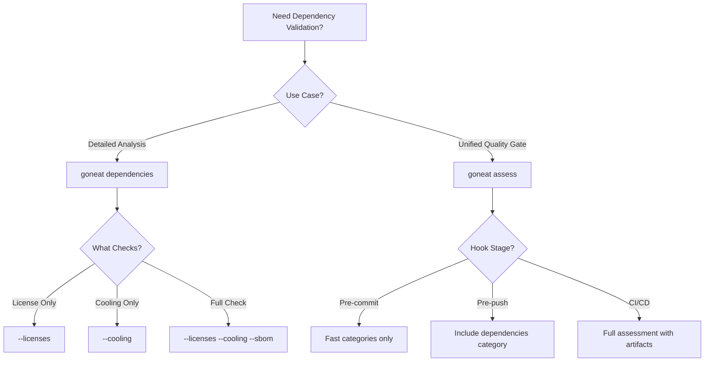

# Dependency Protection Overview

**Complete guide to goneat's supply chain security and license compliance features**

## What is Dependency Protection?

Goneat v0.3.0 introduces comprehensive dependency protection capabilities that help you:

1. **Prevent Supply Chain Attacks** - Block newly published packages that might be compromised
2. **Ensure License Compliance** - Enforce your organization's license policies automatically
3. **Track Software Composition** - Generate SBOMs (Software Bill of Materials) for transparency
4. **Automate Security Gates** - Integrate checks into git hooks and CI/CD pipelines

## Requirements

> **Policy File Required**: To enforce license compliance, you must create a `.goneat/dependencies.yaml` file that defines your forbidden/allowed licenses. Without this file, `goneat assess --categories dependencies` will scan dependencies but **will not flag license violations** — there's no default forbidden list.
>
> See [Quick Start Guide](#quick-start-guide) below for a template.

## Why Do You Need This?

### The Supply Chain Attack Problem

In recent years, package registries have been targeted by attackers who:

- Hijack popular package names after developers abandon them
- Publish malicious packages with names similar to popular ones (typosquatting)
- Compromise maintainer accounts and inject malicious code into trusted packages

**Real-world examples:**

- **ua-parser-js** (2021): 8+ million weekly downloads, compromised to install cryptominers
- **node-ipc** (2022): Maintainer added malicious code targeting Russian/Belarusian users
- **event-stream** (2018): Bitcoin wallet stealing code injected into popular npm package

### Package Cooling Policy - Your Defense

**Package Cooling** enforces a waiting period before adopting newly published packages. This simple rule prevents:

- **Zero-day supply chain attacks**: Most attacks are detected within days
- **Account takeovers**: Community reports compromised packages quickly
- **Typosquatting**: Malicious packages are usually caught and removed fast

**How it works:**

```
Package Published → [Cooling Period: 7 days] → Safe to Use
```

During the cooling period:

- Community reviews the code
- Security researchers analyze it
- Package registries may detect and remove malicious packages
- Your team is protected

## Three Core Features

### 1. License Compliance

Automatically detect and enforce license policies across your dependencies:

```yaml
# .goneat/dependencies.yaml
licenses:
  forbidden:
    - GPL-3.0 # Strong copyleft
    - AGPL-3.0 # Network copyleft
  allowed:
    - MIT
    - Apache-2.0
    - BSD-3-Clause
```

**Use cases:**

- Enterprise legal compliance
- Open source vs proprietary restrictions
- Preventing viral licenses in commercial software

[→ Full License Compliance Guide](../appnotes/license-policy-hooks.md)

### 2. Package Cooling Policy

Enforce minimum package maturity before adoption:

```yaml
# .goneat/dependencies.yaml
cooling:
  enabled: true
  min_age_days: 7 # Minimum package age
  min_downloads: 100 # Minimum total downloads
  exceptions:
    - pattern: "github.com/myorg/*" # Trust internal packages
      reason: "Internal packages are pre-vetted"
```

**Use cases:**

- Supply chain attack mitigation
- Corporate security policies
- Risk reduction for critical infrastructure

[→ Package Cooling Policy Guide](package-cooling-policy.md)

### 3. SBOM Generation

Generate Software Bill of Materials for compliance and security.

Note: SBOM generation produces inventory artifacts, but license policy enforcement is currently based on language-native analyzers (Go: `go-licenses`). SBOM-to-license-inventory ingestion is planned (v0.3.22+).

```bash
# Generate SBOM in CycloneDX format
goneat dependencies --sbom

# Output: sbom/goneat-<timestamp>.cdx.json
```

**Use cases:**

- Regulatory compliance (Executive Order 14028)
- Vulnerability management
- License auditing
- Supply chain transparency

[→ SBOM Workflow Guide](sbom-workflow.md)

## Quick Start Guide

### 1. Configure Your Policy (Required)

**This step is mandatory.** Without a policy file, license violations will not be detected.

Create `.goneat/dependencies.yaml`:

```yaml
version: v1

# License compliance
licenses:
  forbidden:
    - GPL-3.0
    - AGPL-3.0

# Supply chain security
cooling:
  enabled: true
  min_age_days: 7
  min_downloads: 100
```

### 2. Test Manually (1 minute)

```bash
# Check license compliance
goneat dependencies --licenses

# Check cooling policy (requires network)
goneat dependencies --cooling

# Generate SBOM
goneat dependencies --sbom
```

### 3. Add to Hooks (2 minutes)

```yaml
# .goneat/hooks.yaml
version: v1
hooks:
  pre-commit:
    - command: dependencies
      args: ["--licenses", "--fail-on", "high"]

  pre-push:
    - command: dependencies
      args: ["--licenses", "--cooling", "--fail-on", "high"]
```

Install hooks:

```bash
goneat hooks install
```

**Done!** Your repository now has automatic dependency protection.

## Network Requirements

**Critical to understand:**

| Feature            | Network Required       | Best Hook Stage |
| ------------------ | ---------------------- | --------------- |
| License Compliance | ❌ No (offline)        | pre-commit ✅   |
| Cooling Policy     | ✅ Yes (registry APIs) | pre-push ✅     |
| SBOM Generation    | ❌ No (offline)        | CI/release ✅   |

**Why this matters:**

- Pre-commit hooks should be fast and work offline → Use license checks only
- Pre-push hooks can use network → Add cooling policy
- CI pipelines have network → Run full checks + generate SBOMs

[→ Detailed Network Considerations](../user-guide/workflows/dependency-gating.md#network-considerations)

## Integration Patterns

### Pattern 1: Standalone Commands

Use `goneat dependencies` directly for detailed analysis:

```bash
# Comprehensive dependency check
goneat dependencies --licenses --cooling --sbom --fail-on high
```

**Best for:**

- CI/CD pipelines
- Manual investigation
- Detailed reporting

### Pattern 2: Assessment Integration

Use `goneat assess --categories dependencies` for unified reporting:

```bash
# Integrated assessment with other quality checks
goneat assess --categories format,lint,security,dependencies --fail-on high
```

**Best for:**

- Git hooks
- Pre-commit/pre-push checks
- Unified quality gates

### Which Pattern Should I Use?



[→ Complete Integration Guide](../user-guide/workflows/dependency-gating.md)

## Common Workflows

### Workflow 1: Enterprise Security (Recommended)

**Goal:** Maximum security with minimal friction

```yaml
# .goneat/hooks.yaml
hooks:
  pre-commit: # Fast, offline
    - command: dependencies
      args: ["--licenses", "--fail-on", "high"]

  pre-push: # Comprehensive, online
    - command: assess
      args: ["--categories", "dependencies", "--fail-on", "high"]
```

**Benefits:**

- Fast commits (license checks only, offline)
- Comprehensive pre-push validation (includes cooling)
- Catches issues before code review

### Workflow 2: CI-Only (Minimal Local Friction)

**Goal:** No local hooks, centralized validation

```yaml
# .github/workflows/security.yml
- name: Dependency Security Check
  run: |
    goneat dependencies --licenses --cooling --fail-on high

- name: Generate SBOM
  run: |
    goneat dependencies --sbom --sbom-output sbom/release.cdx.json
```

**Benefits:**

- No local hook overhead
- Consistent CI enforcement
- SBOM artifacts for releases

### Workflow 3: Development-Friendly (Warnings Only)

**Goal:** Non-blocking validation with visibility

```bash
# Pre-commit: warn only
goneat dependencies --licenses --fail-on critical

# Pre-push: fail on high
goneat dependencies --licenses --cooling --fail-on high
```

**Benefits:**

- Developers see issues without blocking commits
- Strict enforcement at push time
- Good for gradual adoption

[→ More Workflows](../user-guide/workflows/dependency-gating.md)

## Documentation Navigation

### Getting Started

- **[This Overview](dependency-protection-overview.md)** - Start here
- **[Package Cooling Policy](package-cooling-policy.md)** - Supply chain security deep dive
- **[License Compliance Reporting](license-compliance-reporting.md)** - How to prove compliance to stakeholders
- **[SBOM Workflow Guide](sbom-workflow.md)** - SBOM lifecycle and best practices

### Reference

- **[Dependencies Command](../user-guide/commands/dependencies.md)** - Complete CLI reference
- **[Dependency Gating Workflow](../user-guide/workflows/dependency-gating.md)** - Integration patterns
- **[License Policy Hooks](../appnotes/license-policy-hooks.md)** - Hook configuration guide

### Support

- **[Troubleshooting](../troubleshooting/dependencies.md)** - Common issues and solutions
- **[Configuration Reference](../configuration/dependency-policy.md)** - Policy schema documentation

## Key Concepts

### Cooling Period

The time between when a package is published and when it's considered safe to use. Default: 7 days.

**Why 7 days?**

- Most supply chain attacks are detected within 3-5 days
- Community has time to review and report issues
- Security researchers can analyze new packages
- Balance between security and developer velocity

### Exception Patterns

Allow specific packages to bypass cooling policy:

```yaml
cooling:
  exceptions:
    - pattern: "github.com/myorg/*"
      reason: "Internal packages"
    - pattern: "github.com/spf13/*"
      reason: "Trusted maintainer"
```

**Use sparingly** - exceptions reduce security effectiveness.

### Conservative Fallback

When registry APIs fail (rate limits, network issues), goneat assumes packages are old enough to pass:

- Assumes package age = 365 days
- Marks dependency with `age_unknown=true`
- Logs warning but doesn't block builds

This prevents transient network issues from breaking builds while maintaining security.

[→ Detailed Policy Configuration](package-cooling-policy.md#policy-configuration)

## Performance Considerations

### Registry API Caching

goneat caches registry metadata for 24 hours:

- **First run:** ~2 seconds per 100 dependencies
- **Cached runs:** ~50ms per 100 dependencies

Cache location: `~/.goneat/cache/registry/`

### Parallel Processing

- Registry API calls run in parallel
- Connection pooling for efficiency
- Batch policy evaluation

Typical performance: < 5 seconds for 100 dependencies with caching.

[→ Performance Optimization Guide](../user-guide/workflows/dependency-gating.md#performance)

## Next Steps

1. **Read the Cooling Policy Guide** → [package-cooling-policy.md](package-cooling-policy.md)
2. **Configure your policy** → Create `.goneat/dependencies.yaml`
3. **Test manually** → Run `goneat dependencies --licenses --cooling`
4. **Add to hooks** → Follow [integration guide](../user-guide/workflows/dependency-gating.md)
5. **Monitor and refine** → Adjust policy based on team needs

## Support

- **Questions?** See [Troubleshooting Guide](../troubleshooting/dependencies.md)
- **Feature requests?** Open an issue on [GitHub](https://github.com/fulmenhq/goneat/issues)
- **Enterprise support?** Contact support@3leaps.net

---

**Remember:** Dependency protection is about balance. Start with reasonable defaults (7-day cooling), add exceptions for trusted sources, and adjust based on your team's security posture and development velocity.

---

**Last Updated:** October 28, 2025  
**Status:** Active  
**Part of:** goneat v0.3.0 Dependency Protection Features
